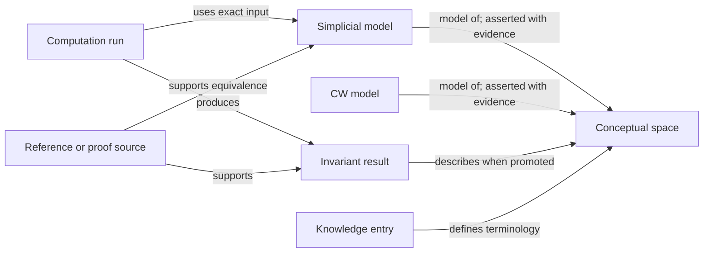

# Domain model

## The central distinction

A topological or homotopy type is not the same thing as a finite presentation of it.

For example, a sphere can have many triangulations. A computation runs against a particular encoded triangulation or CW structure; the mathematical result may be promoted to the conceptual sphere only when the relationship between that model and the space is supported. Collapsing these into one row would make provenance and deduplication unreliable.



## Core entities

### Mathematical object

The conceptual object users browse and cite.

Initial fields:

- immutable internal ID;
- object kind (`space` initially; later `spectrum`, `map`, or `chain_complex`);
- preferred name and display notation;
- aliases;
- optional family and parameters;
- short description;
- lifecycle state (`draft`, `reviewed`, `deprecated`, `redirect`);
- source, completeness, reliability, and label knowledge links.

### Model

A concrete, serializable presentation.

Initial fields:

- immutable model ID;
- format and format version;
- representation type (`simplicial_complex`, `regular_cw_complex`, `simplicial_set`);
- canonicalized content hash and original artifact hash;
- object-storage location or inline representation for small models;
- summary counts by dimension;
- external source identifier and source version;
- parser/importer version;
- licensing metadata.

Two byte-distinct files may encode isomorphic models. Keep the source artifacts, canonicalize where possible, and record the asserted relationship rather than silently merging them.

### Relationship assertion

A typed, directed statement connecting two records.

Examples:

- `model_of`;
- `homeomorphic_to`;
- `homotopy_equivalent_to`;
- `isomorphic_model_to`;
- `suspension_of`, `loop_space_of`, `wedge_factor_of`, `product_factor_of`;
- `covering_of`, `fiber_of`, `base_of`, `boundary_of`.

Every relationship must carry provenance, status, author/editor, and optional machine-check details. Symmetry or transitivity should be derived only for relationship types where it is mathematically valid.

### Invariant definition

Defines what a result means independently of any one page.

Initial invariant: ordinary homology, parameterized by coefficient ring, reduced/unreduced convention, and degree.

The definition record owns display conventions, validation rules, searchable projections, and a knowledge entry. This prevents every dataset from inventing its own encoding.

### Result assertion

A claim about an object or model. It is not just a value.

Required context:

- subject;
- invariant and all parameters;
- normalized value plus a display form;
- status (`exact`, `lower_bound`, `upper_bound`, `range`, `conjectural`, `unknown`, `not_computed`, `not_applicable`, `conflicting`);
- derivation type (`literature`, `computation`, `formal_proof`, `import`, `inference`);
- source or computation run;
- reviewer and review timestamp;
- validity interval or superseding result when corrections occur.

Never encode an unknown result as SQL `NULL` alone. `NULL` means missing metadata; mathematical knowledge states are explicit values.

### Computation run

A reproducibility envelope:

- exact model/input hashes;
- software, package, and algorithm versions;
- command or code snippet;
- parameters and coefficient ring;
- container or environment digest when available;
- start/end times and resource summary;
- stdout/stderr artifacts;
- exit state;
- output hash;
- person or automated agent responsible.

### Reference and contribution

Use structured references (DOI, arXiv ID, book metadata, URL, and pinpoint such as theorem/table/page). A contribution record credits data generation, import, review, correction, code, and exposition separately.

## A normalized homology value

For finitely generated abelian groups over the integers, store a canonical decomposition rather than only LaTeX:

```json
{
  "theory": "ordinary_homology",
  "reduced": false,
  "coefficients": {"ring": "Z"},
  "degree": 2,
  "group": {
    "free_rank": 1,
    "torsion_invariant_factors": [2, 12]
  }
}
```

Validation should require positive invariant factors greater than one, sorted so each divides the next. For field coefficients, store the field and vector-space dimension. Preserve a separate rendered form such as `Z ⊕ Z/2 ⊕ Z/12` for convenience, but generate it from normalized data.

Search projections such as Betti number, torsion primes, and torsion exponent should be generated and indexed rather than hand-entered.

For efficient torsion queries, the read model should also store the primary decomposition as rows of `(prime, exponent, multiplicity)`. The invariant-factor representation is convenient for display and interchange; primary rows make questions such as “has 2-torsion in degree 3” and “contains a summand of order divisible by 9” indexable without scanning or reparsing JSON.

## Labels and permanent URLs

LMFDB prefers human-readable mathematical labels. Topology makes a fully semantic permanent label dangerous: preferred names change, multiple constructions describe the same space, and recognition may be undecidable.

Use a hybrid scheme:

- immutable citation ID: `ATSP-000001`;
- permanent URL: `/Space/ATSP-000001`;
- human aliases and redirects: `/Space/Sphere/2`, `S2`, `2-sphere`;
- immutable model ID: `ATMD-000001`;
- model content hash exposed in downloads and API responses.

The citation ID is boring on purpose. The UI can emphasize mathematical names while the database preserves identity through renames and merges.

## First relational schema

An implementation can begin with these logical tables:

- `objects`;
- `object_names`;
- `families` and `family_instances`;
- `models` and `model_artifacts`;
- `relationship_assertions`;
- `invariant_definitions`;
- `result_assertions`;
- `computation_runs` and `run_artifacts`;
- `references` and `assertion_references`;
- `contributors` and `contributions`;
- `knowledge_entries`;
- `review_events`.

PostgreSQL is a good fit for searchable, typed projections and joins. Large presentations, logs, and images belong in content-addressed object storage, with hashes and metadata in PostgreSQL. JSON columns are appropriate for invariant-specific payloads, but common search fields should have typed columns and indexes.

Use two layers for results:

- append-only assertions are the provenance-rich source of truth;
- a rebuildable `current_homology_groups` read model contains the selected published result per subject, coefficient system, convention, and degree.

The current projection should have typed columns for free rank or vector-space dimension, plus a child table for primary torsion summands. This keeps downstream queries simple while corrections, conflicts, and superseded results remain available in assertion history.

## Promotion rule

Computed results start on the concrete model. They can be shown as results for the conceptual space only when:

1. the model-to-space assertion is reviewed at the necessary equivalence level;
2. the invariant is preserved by that equivalence level;
3. the run passed schema and internal consistency checks;
4. the project's validation policy for that result class is satisfied.

This rule should be implemented explicitly, not left to editorial convention.
